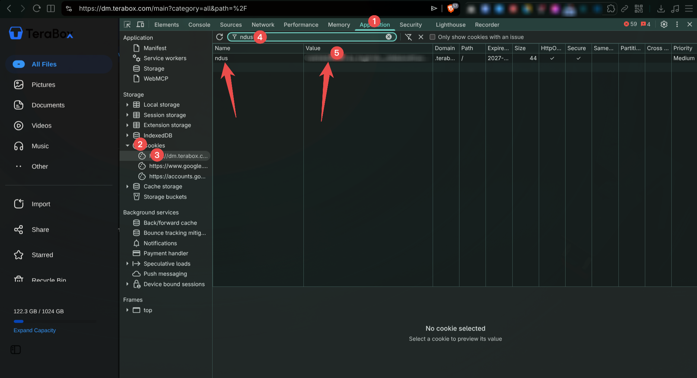

# TeraBox Live-Sync Setup (rclone + systemd) — Omarchy

TeraBox has no native Linux sync client. This setup uses `rclone bisync` +
a systemd user timer to approximate live sync, plus a wrapper script for
failure tracking.

> **Before you start:** replace these placeholders throughout with your own values:
> - `<REMOTE_NAME>` — whatever you name your rclone remote (e.g. `terabox`, `tb`)
> - `<REMOTE_FOLDER>` — the folder on TeraBox you want to sync to
> - `~/cloud-sync` — your local sync folder path (rename if you like)

> **⚠️ Important disclaimer — about the tool:** This guide uses
> [**bclone**](https://github.com/BenjiThatFoxGuy-Labs/bclone), an **unofficial
> fork of rclone** that adds TeraBox (and other) backend support. It is
> **not mainline rclone** and **not an official TeraBox integration**:
> - TeraBox provides no public API or official client credentials — bclone's
>   TeraBox backend works by reusing your logged-in browser session cookie,
>   reverse-engineered against TeraBox's web endpoints
> - It can break without warning if TeraBox changes their site
> - Auth is a live session cookie, not an OAuth token — treat it like a password (see security note below)
> - Expect occasional instability (rate limits, captchas, upload failures on large files)
>
> **Only install from the official repo:** `github.com/BenjiThatFoxGuy-Labs/bclone`
> (or the matching AUR packages `bclone-bin` / `bclone-git`). The maintainer
> has flagged that fake "continuation" forks exist that impersonate this
> project to distribute malware — don't trust forks claiming to be an
> updated/continued version.

- **Local sync folder:** `~/cloud-sync`
- **Remote:** `<REMOTE_NAME>:/<REMOTE_FOLDER>` (rclone remote name `<REMOTE_NAME>` (your choice), TeraBox folder `<REMOTE_FOLDER>`)
- **Sync interval:** every 5 minutes
- **Compare method:** `--size-only` (TeraBox doesn't reliably support modtime or checksum comparison)

---

## 1. Install bclone

TeraBox support isn't in mainline rclone's official Arch package, so install **bclone** instead:

```bash
# via AUR (pick one)
yay -S bclone-bin     # prebuilt binary, faster install
yay -S bclone-git     # builds from source, latest commits
```

Or manually from GitHub releases: https://github.com/BenjiThatFoxGuy-Labs/bclone/releases

> Note: bclone is a drop-in replacement for the `rclone` binary — same
> commands, same config format, just with extra backends. This guide will
> keep using `rclone` in commands below, but you're actually invoking
> bclone's binary (name it/alias it as `rclone` or adjust commands to
> `bclone` depending on how you installed it).

## 2. Configure the TeraBox remote

```bash
rclone config
```

Full walkthrough:
1. `n` → New remote
2. `name>` → `<REMOTE_NAME>`
3. `Storage>` → type `terabox` (option 56 in the list) → Enter
4. `cookie>` → paste your TeraBox `ndus` cookie value (see below for how to get it)
5. `Edit advanced config?` → `n` (No)
6. `Keep this "<REMOTE_NAME>" remote?` → `y` (Yes)
7. `q` to quit config

**Getting the cookie:**
- Log into TeraBox in a browser
- Open DevTools → Application/Storage → Cookies → `www.terabox.com`
- Copy the `ndus` cookie value (or the full cookie string, rclone accepts either)


*DevTools → Application tab → Cookies → select the TeraBox domain → find `ndus` → copy its Value (value redacted in this example — never share your real cookie value)*

Test the remote:
```bash
rclone lsd <REMOTE_NAME>:
```
Should list your top-level TeraBox folders.

**Alternative: edit the `.conf` file directly**

The interactive wizard above just writes to a config file at
`~/.config/rclone/rclone.conf`. If you prefer, skip the wizard and edit
that file directly instead:

```bash
mkdir -p ~/.config/rclone
nano ~/.config/rclone/rclone.conf
```

Add a block like this:
```ini
[<REMOTE_NAME>]
type = terabox
cookie = <YOUR_NDUS_COOKIE_VALUE>
```

Save, then test the same way:
```bash
rclone lsd <REMOTE_NAME>:
```

This is faster for repeat setups or scripting, but the file is still
plaintext — same security note below applies either way.

**⚠️ Security — the cookie is a live login session:**
- It's stored **in plaintext** in `~/.config/rclone/rclone.conf`
- Anyone with this cookie can access the TeraBox account without a password
- **Never paste/share this cookie value, or the config file itself, anywhere** (chat, screenshots, terminal recordings, public repos)
- Add `rclone.conf` to `.gitignore` if it ever lives inside a project folder
- If it's ever exposed, change the TeraBox account password immediately — this invalidates the old session/cookie — then reconfigure the remote with a fresh cookie:
  ```bash
  rclone config
  # e (Edit existing remote) → <REMOTE_NAME> → paste new cookie
  ```
  or just edit the `cookie =` line in `rclone.conf` directly.

## 3. Local folder

```bash
mkdir -p ~/cloud-sync
```

## 4. First-time sync (baseline)

**Do NOT interrupt this (no Ctrl+C) — let it finish, especially with large files.**

```bash
rclone bisync ~/cloud-sync <REMOTE_NAME>:/<REMOTE_FOLDER> --resync --size-only
```

> Note: `--checksum` doesn't work here — TeraBox doesn't expose file hashes,
> so rclone falls back to size/modtime anyway. Stick to `--size-only`.

Verify after it finishes:
```bash
rclone check ~/cloud-sync <REMOTE_NAME>:/<REMOTE_FOLDER> --size-only
```

## 5. Regular sync (after baseline exists)

```bash
rclone bisync ~/cloud-sync <REMOTE_NAME>:/<REMOTE_FOLDER> --size-only
```
(no `--resync` needed after the first run)

## 6. Failure-tracking wrapper script

Scripts live in `~/.config/cloud-sync/scripts/`:

- `terabox-sync.sh` — runs bisync, logs everything to
  `~/.local/share/terabox-sync/sync.log`, and extracts ERROR lines into
  `~/.local/share/terabox-sync/failed.log`
- `terabox-retry.sh` — shows recent failures; `--retry` flag re-runs sync
- `terabox-tui.py` — optional terminal dashboard for sync reports (see step 9)

Setup:
```bash
mkdir -p ~/.config/cloud-sync/scripts/
# place terabox-sync.sh and terabox-retry.sh here
chmod +x ~/.config/cloud-sync/scripts/*.sh
```

Check failures anytime:
```bash
~/.config/cloud-sync/scripts/terabox-retry.sh          # just show
~/.config/cloud-sync/scripts/terabox-retry.sh --retry  # show + resync
```

## 7. systemd user service + timer (auto-sync every 5 min)

`~/.config/systemd/user/terabox-sync.service`:
```ini
[Unit]
Description=TeraBox bisync

[Service]
Type=oneshot
ExecStart=%h/.config/cloud-sync/scripts/terabox-sync.sh
```

`~/.config/systemd/user/terabox-sync.timer`:
```ini
[Unit]
Description=Run TeraBox sync every 5 minutes

[Timer]
OnBootSec=2min
OnUnitActiveSec=5min

[Install]
WantedBy=timers.target
```

Enable:
```bash
systemctl --user daemon-reload
systemctl --user enable --now terabox-sync.timer
```

## 8. Monitoring

```bash
# live systemd status
journalctl --user -u terabox-sync.service -f

# timer status
systemctl --user status terabox-sync.timer

# custom logs
tail -f ~/.local/share/terabox-sync/sync.log
cat ~/.local/share/terabox-sync/failed.log
```

For a friendlier way to view this, see the TUI app below.

## 9. TUI app for sync reports (optional)

A small terminal dashboard (`terabox-tui.py`) that reads `sync.log` /
`failed.log` and shows sync history and failures without grepping log
files by hand — plus a one-key retry.

**What it shows:**
- Status bar with the last run's result (✅/❌) and a recent failure count
- A table of recent sync runs (time, status, error count), color-coded
- A scrollable panel listing recent failure details
- Auto-refreshes every 30 seconds

**Setup:**
```bash
sudo pacman -S python-pip
pip install textual --break-system-packages
mkdir -p ~/.config/cloud-sync/scripts
# place terabox-tui.py in ~/.config/cloud-sync/scripts/
chmod +x ~/.config/cloud-sync/scripts/terabox-tui.py
```

**Run:**
```bash
python3 ~/.config/cloud-sync/scripts/terabox-tui.py
```

**Keybindings:**
| Key | Action |
|-----|--------|
| `r` | Retry sync now (runs `terabox-sync.sh` directly) |
| `f` | Refresh the view manually |
| `q` | Quit |

> The TUI expects `terabox-sync.sh` at `~/.config/cloud-sync/scripts/terabox-sync.sh` (from step 6) — if you placed it elsewhere, edit the `SYNC_SCRIPT` path near the top of `terabox-tui.py`.

---

## Known issues / gotchas

- **Not true instant sync.** This is polling every 5 min, not inotify-based
  real-time sync like Dropbox.
- **Never Ctrl+C a bisync run**, especially with large files mid-transfer —
  it can leave partial/corrupt files on the remote. If it happens, delete
  the broken file on remote (`rclone deletefile "<REMOTE_NAME>:/path/to/file"`) and
  resync.
- **`--checksum` is a no-op for TeraBox** — no shared hash support, falls
  back to modtime/size. Use `--size-only` instead.
- To sync only a subfolder instead of everything, point both sides at that
  subfolder, e.g.:
  ```bash
  rclone bisync ~/cloud-sync-subfolder <REMOTE_NAME>:/<SUBFOLDER> --resync --size-only
  ```
